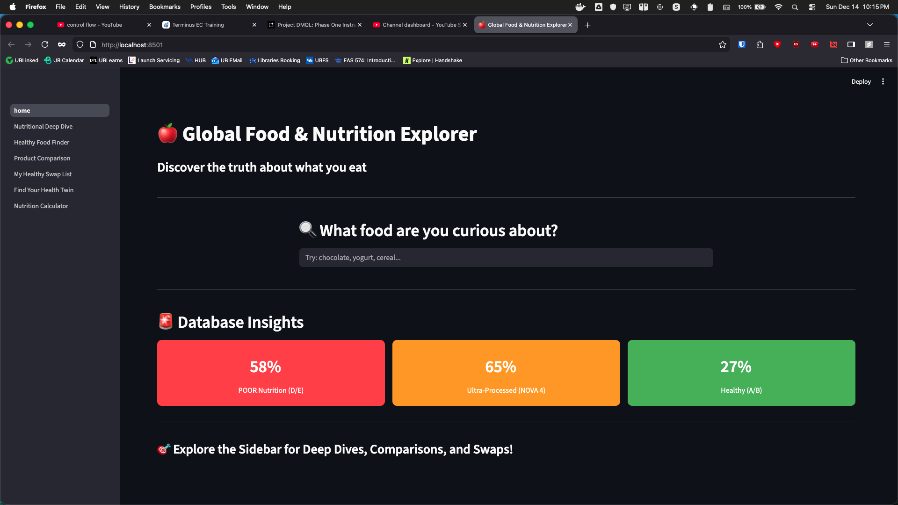
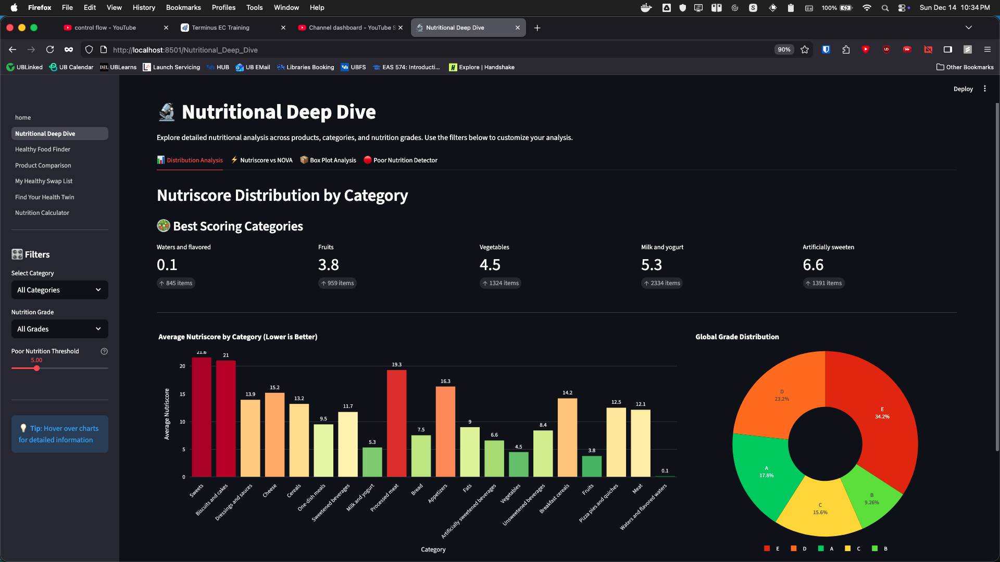

# Global Food & Nutrition Explorer

This is the group project for EAS 550: Data Models and Query Languages, submitted by Akash Ankush Kamble, Nidhi Rajani, and Goutham Chengalvala.

## Project Overview

The "Global Food & Nutrition Explorer" is an end-to-end database application designed to ingest, clean, and structure the vast Open Food Facts dataset. Our goal was to transform raw, messy data into a normalized relational database and a high-performance data warehouse, accessible via a user-friendly interactive dashboard.

This repository contains the complete pipeline for **Phase 1 (ETL & OLTP)**, **Phase 2 (OLAP & Analytics)**, and **Phase 3 (Application Layer)**.

---

## 👥 Team & Contribution

We adopted an agile workflow with tasks distributed equally across all phases.

| Team Member | Primary Roles & Contributions |
| :--- | :--- |
| **Akash Ankush Kamble** | **Database Architect & Security.** Designed the 3NF Schema, implemented RBAC security roles, and managed the final integration of the application layer. |
| **Nidhi Rajani** | **Frontend Lead & Documentation.** Developed the Streamlit UI/UX, designed the visualizations, and compiled the project documentation and reports. |
| **Goutham Chengalvala** | **Data Engineer & Analytics.** Built the Python ingestion pipeline, implemented the dbt Data Warehouse transformation, and optimized SQL query performance. |

---

## 🚀 Project Milestones & Journey

### ✅ Milestones Achieved

1. **Robust ETL Pipeline:** Successfully ingested 115,000+ products, handling missing values and data type standardization.
2. **3NF Normalization:** Decomposed a flat CSV into 10 relational tables to eliminate redundancy.
3. **Data Warehouse:** Implemented a Star Schema using **dbt** to optimize analytical queries.
4. **Performance Tuning:** Achieved query optimization using B-Tree and GIN indexes.
5. **Interactive App:** Deployed a Dockerized Streamlit dashboard with 7 distinct features.

### 🛠️ Issues Encountered & Solutions

| Issue | Solution |
| :--- | :--- |
| **Numeric Overflow** | Some products had erroneous energy values (>100k kcal). We updated the schema to `NUMERIC(10,3)` and added cleaning logic in Python to handle outliers. |
| **Constraint Violations** | Duplicate tags in the source data caused Primary Key violations in junction tables. We implemented a `set()` conversion logic in the ingestion script to enforce uniqueness. |
| **dbt Materialization** | dbt initially created Views instead of Tables. We reconfigured `dbt_project.yml` to materialize models as Tables for better performance. |
| **Permissions** | The read-only analyst role could not access new dbt tables. We implemented `ALTER DEFAULT PRIVILEGES` in Postgres to automatically grant access to future tables. |

---

## Phase 1: Database Foundation (OLTP)

**Goal:** Build a robust, normalized (3NF), and secure PostgreSQL database.

### Core Technologies

- **Containerization:** Docker & Docker Compose
- **Database:** PostgreSQL 15
- **Data Ingestion:** Python 3, Pandas, SQLAlchemy
- **Version Control:** Git & GitHub

### How to Run Phase 1

**Prerequisites:**

- Docker Desktop installed and running.
- Python 3.8+ and `pip` installed.

#### 1. Clone the Repository

```bash
git clone https://github.com/Gouthamch07/EAS550_Project.git
cd EAS550_Project
```

#### Step 2: Set Up the Python Environment

It is recommended to use a virtual environment.

```bash
python -m venv venv
source venv/bin/activate  # On Windows: venv\Scripts\activate
pip install -r requirements.txt
```

#### Step 3: Launch Database & Ingest Data

This command will start the PostgreSQL and pgAdmin containers. On the first run, it will automatically create the database schema and security roles by executing the files in the `sql/` directory.

```bash
docker-compose -f docker/docker-compose.yml up -d
```

#### Step 4: Run the Data Ingestion Script

This script will download the raw data, clean it, and populate the running database.

```bash
python scripts/ingest_data.py
```

The Phase 1 is now complete! The database `food_nutrition_db` is fully populated and ready for querying.

### Accessing the Database

You can connect to the database using any standard SQL client or the included pgAdmin interface.

- **pgAdmin URL:** `http://localhost:8080`
- **Email:** `admin@food-nutrition.com`
- **Password:** `admin`

**Server Connection Details:**

- **Host:** `food_nutrition_db`
- **Port:** `5432`
- **Database:** `food_nutrition_db`
- **Username/Password:** Use the `postgres` superuser, `analyst_user`, or `app_service_user` credentials.

If you need a video demonstration of the setup process, please refer to the following link: [Video Demonstration](https://youtu.be/WSvt6auAOsg)

---

## Phase 2: Analytical Layer & Optimization (OLAP)

**Goal**: Analyze the data using advanced SQL, optimize query performance, and build a Data Warehouse.

**Key Features**:

- **Advanced Analytics**: Complex SQL queries using Window Functions, CTEs, and Aggregations to answer business questions (e.g., Brand Leaderboards, Hidden Sugar detection).
- **Performance Tuning**: Implementation of B-Tree and GIN indexes to optimize query execution. Detailed analysis is available in [Performance_Tuning_Report.md](./Performance_Tuning_Report.md).
- **Data Warehousing**: Transformation of the 3NF schema into a Star Schema using dbt, enabling efficient OLAP workflows.

### How to Run Phase 2

#### Step 1: Run Analytical Queries

Execute the advanced business queries against the populated database:

```bash
docker exec -i food_nutrition_db psql -U postgres -d food_nutrition_db < sql/phase2/analytics_queries.sql
```

### Step 2: Run Performance Tuning Tests

Execute the baseline measurement, index creation, and optimized measurement scripts:

```bash
docker exec -i food_nutrition_db psql -U postgres -d food_nutrition_db < sql/phase2/performance_tuning.sql
```

### Step 3: Build the Data Warehouse (dbt)

To transform the data into the Star Schema (`analytics` schema):

```bash
# Install dbt adapter (if not already installed)
pip install dbt-postgres
```

#### Setting up the Data Warehouse (dbt)

To initialize the dbt project locally, run the following command and enter the configuration details when prompted:

```bash
dbt init
```

#### Enter the following values when prompted

```bash
Which database would you like to use? [1, 2, 3, ...] (enter the number pertaining to 'postgres')
host   : localhost
port   : 5432 (default)
user   : postgres
pass   : password
dbname : food_nutrition_db
schema : analytics
threads: 1 (default)
```

#### Running the dbt Models

```bash
# Navigate to the dbt project directory
cd food_explorer

# Run the models to create the Fact and Dimension tables
dbt run

# move back to the project root
cd ..
```

---

### Connecting to the Database

You can connect to the database using any standard SQL client or the included pgAdmin interface.

- **pgAdmin URL:**  `<http://localhost:8080>`
- **Email:**  `<admin@food-nutrition.com>`
- **Password:**  `admin`

**Server Connection Details:**

- **Host:**  `food_nutrition_db`
- **Port:**  `5432`
- **Database:**  `food_nutrition_db`
- **Username/Password:** Use the `postgres` superuser, `analyst_user`, or `app_service_user` credentials.

---

## Phase 3: The Application Layer (Streamlit Dashboard)

**Goal:** Provide an interactive, user-friendly interface to explore the nutritional data.

📸 Dashboard Preview



### Features

- **Nutritional Deep Dive:** Interactive charts analyzing Nutri-Score distributions across categories.
- **Poor Nutrition Detector:** A tool to identify high-sugar/low-quality products using configurable thresholds.
- **Data Lineage:** Powered by the Phase 2 Star Schema (`analytics` schema) for high-performance querying.
- **Live Database Connection:** Real-time connection to the PostgreSQL container.



### How to Run the App

**Prerequisites:**
Ensure you have completed Phase 1 (Database Ingestion) and Phase 2 (dbt transformation) before running the app.

#### Step 1: Grant Permissions to the Analyst

Since the `analytics` schema was created by dbt *after* the initial security setup, you must manually grant read permissions to the analyst role. Run this command in your terminal:

```bash
docker exec -it food_nutrition_db psql -U postgres -d food_nutrition_db -c "GRANT USAGE ON SCHEMA analytics TO read_only_analyst; GRANT SELECT ON ALL TABLES IN SCHEMA analytics TO read_only_analyst; ALTER DEFAULT PRIVILEGES IN SCHEMA analytics GRANT SELECT ON TABLES TO read_only_analyst;"
```

#### Step 2: Build and Launch the Application

a. **Start the Environment:**

  ```bash
  docker-compose -f docker/docker-compose.yml up -d --build
  ```

b. **Access the Dashboard:**
  Open your browser and navigate to:
  👉 <http://localhost:8501>

c. **Troubleshooting:**
  If the app cannot connect to the database immediately, wait 10 seconds for Postgres to initialize and refresh the page.

---

🎥 Final Video Demonstration

Watch our complete end-to-end walkthrough, covering data ingestion, database structure, and the full application demo.

[Click Here to Watch the Video Demo](https://youtu.be/Wpx4_iM8mR8)
